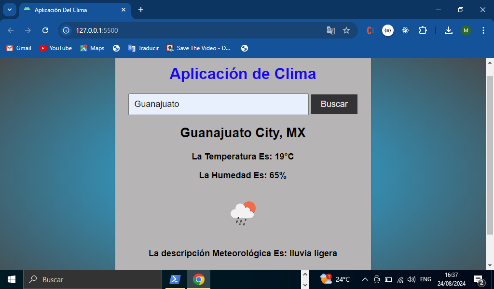

# TITULO DEL PROYECTO    

**Aplicación Web Del Clima Con JavaScript**

# DESCRIPCIÓN DEL PROYECTO
**En este proyecto realizamos una pequeña aplicación web que nos brinda la información del clima de alguna ciudad en específico, que nosotros busquemos. Esta aplicación fue elaborada con conocimientos en HTML, CSS y sus funcionalidades con lenguaje de programación de JavaScript**

# VISTA PREVIA DE COMO SE VE NUESTRA APLICACION YA FUNCIONANDO



# Manejo de api_key y url de la API

**Para poder realizar nuestra aplicación lo que hicimos fue consumir una API que nos trae la información del clima de alguna ciudad que busquemos, cabe señalar que tenemos que registrarnos en dicha API para poder generar una api_key que es una clave única que nos brinda la API para que puede haber una comunicación segura a la hora de pedir los datos**
[Url de la API:](https://api.openweathermap.org/data/2.5/weather)

# Funcionamiento del Input y el botón cuando buscamos la ciudad

**Para poder buscar la ciudad en específico lo que hicimos primero fue hacer uso de algunas propiedades que JavaScript posee como por ejemplo la propiedad document.getElementById para poder comunicar con el HTML a través de su id ,además hicimos uso de la propiedad addEventListener que este lo que hace es poder escuchar un evento en un elemento HTML en este caso el evento click en el botón ya teniendo esto en cuenta podemos ahora lo que sigue el comparar si lo que el usuario escribió corresponde alguna ciudad que tiene la API a continuación muestro como realizamos esta acción:**
```JavaScript 
document.getElementById('botonBusqueda').addEventListener('click', () =>{
    const city = document.getElementById('ciudadEntrada').value
    if(city){
        fetchDatosClima(city)
    }
})
```
# Llamado de la API con la propiedad fetch de JavaScript
**en esta parte hicimos una función para poder mostrar los datos de la API en formato json es decir estamos manipulando la respuesta que nos da la API como se muestra a continuación:**
```JavaScript
function fetchDatosClima(city){
    fetch(`${url}?q=${city}&appid=${api_key}${leng}`)
    .then(data => data.json())
    //.then(response => console.log(response))
    .then(data => mostrarDatosClima(data))
}
```
# Mostrar datos de la API en DOM
**Ahora ya teniendo los datos de la API lo que sigue es poder mostrarlos en la página para ello utilizamos algunas propiedades de JavaScript(innerHTML) esta propiedad establece la sintaxis HTML de un elemento lo cual la reemplazara por una sintaxis nueva del elemento, por otro lado creamos algunas variables que hacen referencia a lo que queremos mostrar por ejemplo: nombre de la ciudad, nombre del pais,temperatura,humedad,una descripción y el icono. Luego haciendo uso de la propiedad document.createElement creamos los elementos HTML de cada variable como lo fue un h2, un párrafo e una imagen para el icono, ya para finalizar con la propiedad appendChild vamos insertando los elementos en el contenedor para poder mostrarlos en nuestra página web, puedes consultar nuestro archivo script.js para poder ver el código mas a detalle y explicado de lo antes mencionado**

### Lista De Tecnologías Y Herramientas Usadas En Nuestro Proyecto  

1. HTML
2. CSS 
3. JavaScript(Manejo de API)
4. Manipulación De DOM(JavaScript)    
5. GitHub
6. Herramienta de Visual Studio Code(live Server)
7. API(https://api.openweathermap.org/data/2.5/weather)

*Elaborado Por: Mario Martínez Aguilar*
 

